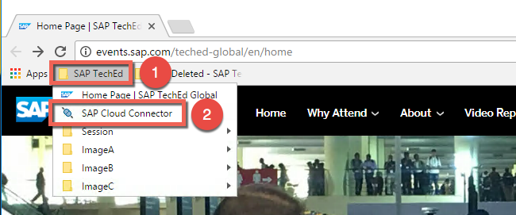
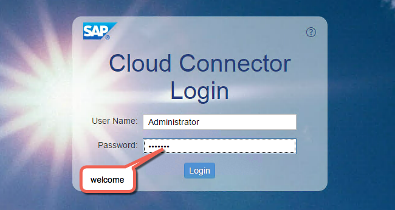
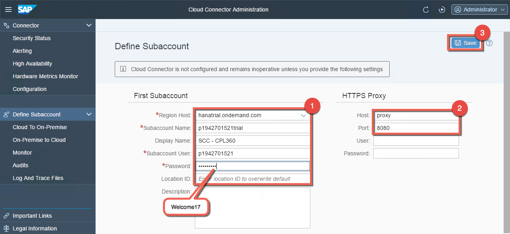
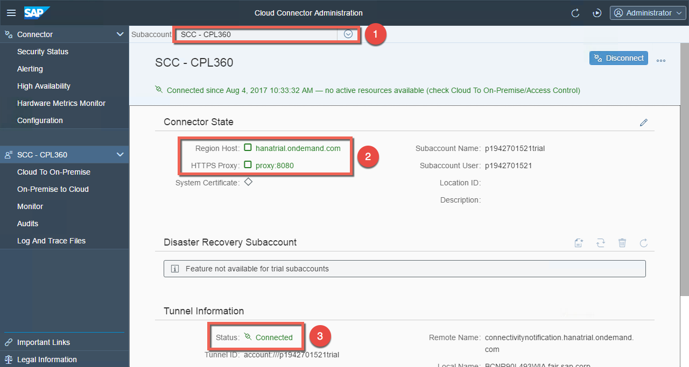
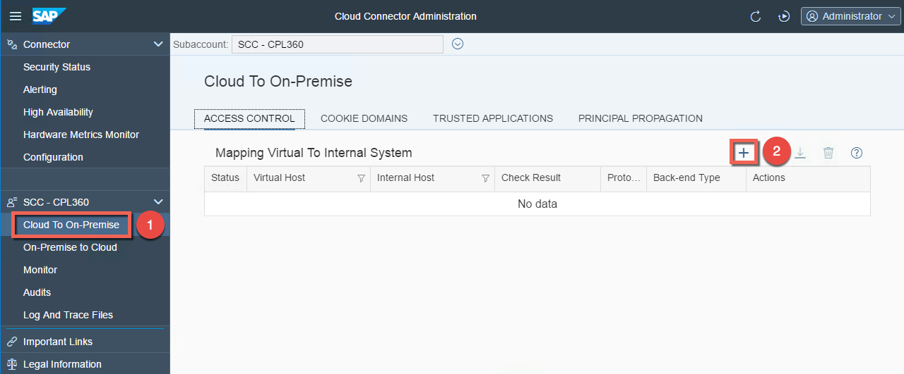
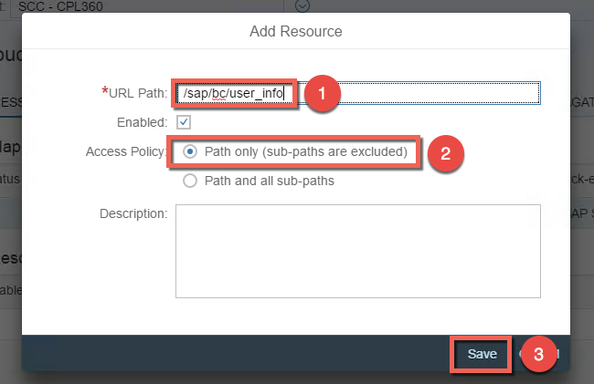
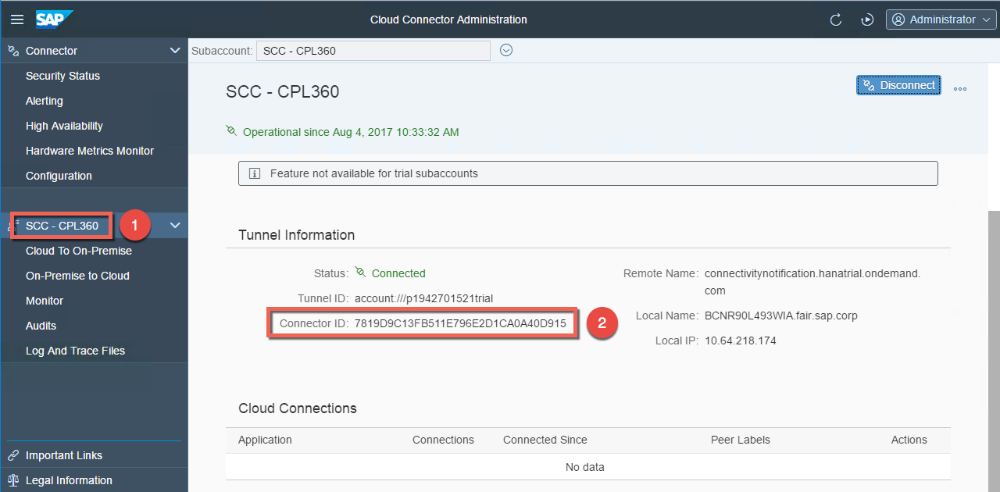

# Exercise A2: Initial configuration of the Cloud Connector to grant access to the backend service

#### Objective
In this exercise, you will initially configure the Cloud Connector so that basic end-to-end connectivity is possible. First you will connect it to your SAP Cloud Platform trial subaccount. Then you will connect it to your local S/4HANA backend service by adding the right system and the right resources.

#### Estimated time
10 minutes
 
 

## Step-by-step guide
1. Open the Cloud Connector running locally on your student laptop by clicking on the bookmark **SAP Cloud Connector** located in the folder **SAP TechEd** in your Chrome browser.  
    

1. Login to the Cloud Connector with the user `Adminstrator` and the password `welcome`.  
    

1. The **Define Subaccount** page will open. Provide the following details to bind your SAP Cloud Platform trial subaccount to the Cloud Connector:
    - Region Host: `hanatrial.ondemand.com`
    - Subaccount Name: `pXXXXXXXXXXtrial`  
    (verify that the "p" is lower case and don't forget the suffix "trial" e.g. p1942701521trial)
    - Display Name: `SCC - CPL360`
    - Subaccount User: `pXXXXXXXXXX` (e.g. p1942701521 without the suffix trial)
    - Password: `Welcome17` (password of your SAP Cloud Platform trial subaccount)
    - No location Id: keep it empty (only needed when using multiple Cloud Connectors in a single subaccount)
    - Proxy host: `proxy`
    - Proxy port: `8080`

1. Click **Save**
  
    

1. Verify that the Subaccount dropdown shows the Display Name that was entered in previous step. Check that the Region Host is set to **hanatrial.ondemand.com**, the HTTPS Proxy is set to **proxy:8080** and both have the status of Green. The Status under **Tunnel Information** should show **Connected**.  
    

1. Now you will grant access to the internal host and define a virtual host (alias) to be used later on in the SAP Cloud Platform Connectivity. Click on **Cloud To On-Premise** and create on **Access Control** by clicking on the **Add** icon.  
    

1. Select the following settings in the wizard
    - Back-end Type: `ABAP System`
    - Protocol: `HTTPS`
    - Internal host: `localabap.fair.sap.corp`
    - Internal port: `44310`
    - Virtual host: `virtualbackend` (don't use the same name as the internal host)
    - Virtual port: `1234` (don't use the same port as the internal port)
    - Principal Type: `None`
    - Check internal host: `Checked`
      

1. Verify that the internal host is reachable
  
    

1. Now you need to define which resource of the internal system should be available in the cloud. Click on the **add-icon** and add `/sap/bc/user_info` as URL path and verify that the **Access Policy** is **Path only** as only this service should be accessible in the cloud. Then click **Save**.
  
    
     
Note that all the resources and the mapping have the state Green. Click on the Check button and verify that the state remains Green.

      > Note: if you encounter any problem with the configuration (e.g. caused by typos), you can alternatively import the access control called **A3_access_control_cpl360.zip** available in the **Student Share** folder. Click on the import icon and choose the zip file to be imported.

1. You have completed the setup of the Cloud Connector to connect your SAP Cloud Platform trial subaccount with the on-premise S/4HANA backend. Before checking the connection in the cloud, have a look at the Cloud Connector ID. You can find it by clicking on the Cloud Connector name and you will see the ID unter **Tunnel Information**.  
    
