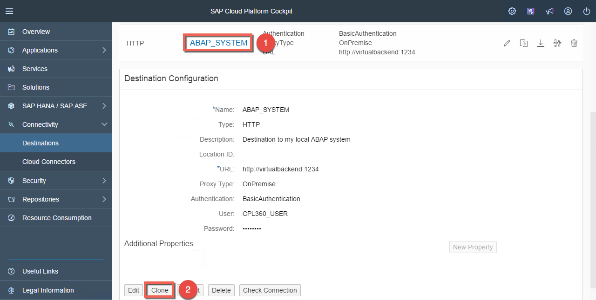
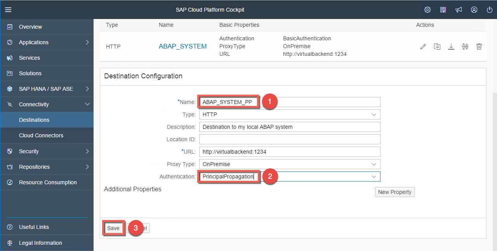

# Exercise B3: Configuration of SAP Cloud Platform Connectivity for principal propagation

#### Objective
In this exercise, you will learn how to configure a destination in the SAP Cloud Platform so that you can propagate the user credentials from the cloud to the backend via the Cloud Connector. First you will clone the existing destination previously used for basic authentication and configure it for principal propagation. And at the end you will test the application.

> Note: Of course, it's possible to update the existing destination, but it takes a couple of minutes that the changes are really effective in the cloud application as the configuration is cached and only updated after a certain time again. This is the reason why we will create a new destination based on the existing one.

#### Estimated time
5 minutes
  

## Step-by-step guide
1. Open the SAP cloud Platform Cockpit and go to to **Destinations** under the section **Connectivity**.  
    

1. Select the existing destination called **ABAP_SYSTEM** and press the button **Clone**.  
    

1. Update the following details of the new created destination and click **Save**:
      - Name: `ABAP_SYSTEM_PP`
      - Authentication: `PrincipalPropagation`  
    

1. That's all. Now you can test the cloud application. But remenber that the name of the destination in defined in the JAVA application. In this exercise we don't want to change the application code and compile it again. This is the reason, why we have introduced a parameter that can be added in the URL. It will overwrite the default destination. Add `?destination=ABAP_SYSTEM_PP` at the end of the URL to use the new destination.

    Then the URL of your cloud application looks like the following one: 
    https://a3demoprincipalpxxxxxxxxxxtria.hanatrial.ondemand.com/A3_DemoPrincipalPropagation/?destination=ABAP_SYSTEM_PP  
    

1. Obviously you should get the error message **Login failed**, because we have added a mistake in the backend configuration. In the next lesson you will learn how to debug it.  
    
