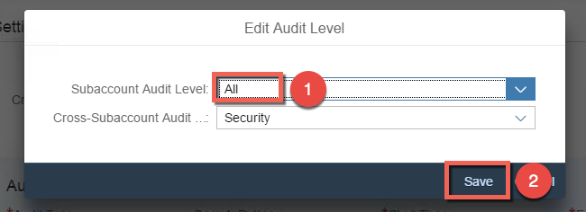
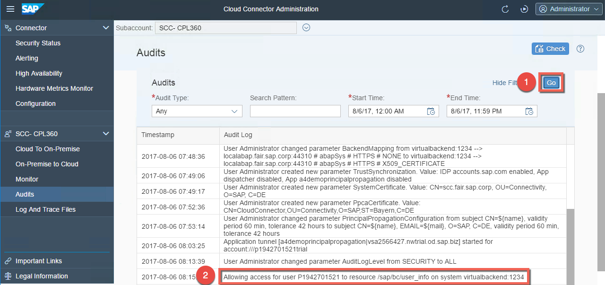
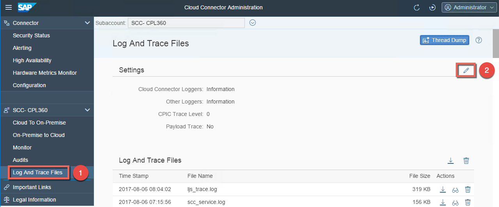
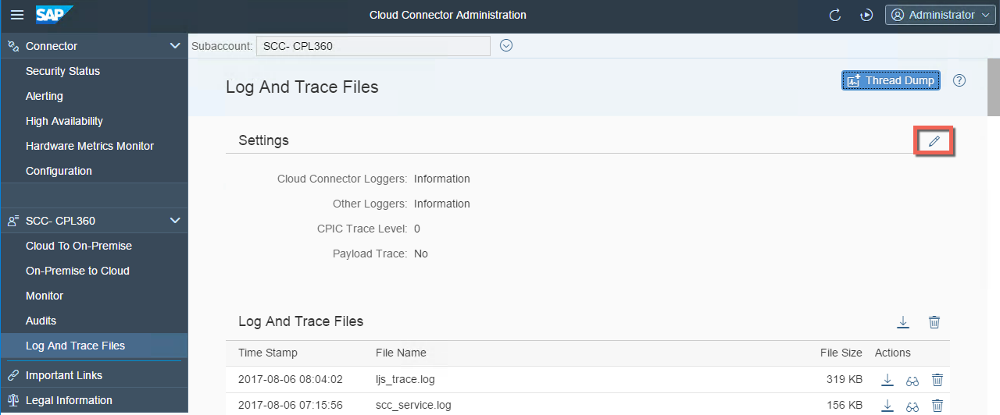
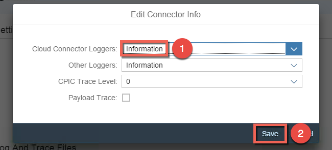
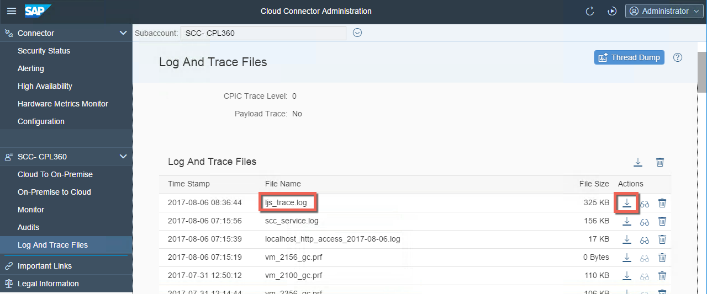
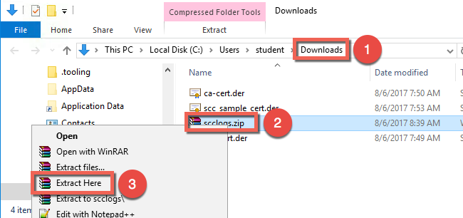
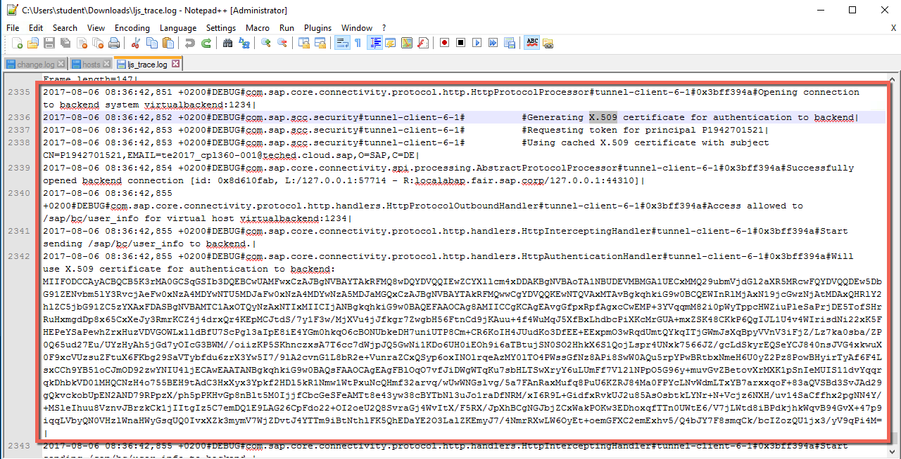

# Exercise C1: Debugging in the Cloud Connector

#### Objective
In this exercise, you will learn how to debug a non-working cloud application on the Cloud Connector side. You will first have a look at the audit logs and then at the traces files.

#### Estimated time
10 minutes
  

## Step-by-step guide
1. First let call again the cloud application and see the error message. If you close the application in the browser already, you can reopen it by calling the following URL: 
    https://a4demoprincipalpxxxxxxxxxxtrial.hanatrial.ondemand.com/A4_DemoPrincipalPropagation/?destination=ABAP_SYSTEM_PP 
    The error message tells you that the **Logon failed**, but you can't get more info here in the cloud. So, let's first check in the Cloud Connector.  
    

1. Open the Cloud Connector and go to **Audits**. Then click on the **Edit** icon to change the trace level.  
    

1. Change the **Subaccount Audit Level** from `Security` to `All` in order to see the cloud requests going through the Cloud Connector. Then Click **Save**.  
    

1. Go to the browser and click the **Refresh** icon to send again the request from the cloud application.  
    

1. Go back to the Cloud connector and refresh the audit logs by pressing the button **Go** and verify the access to the resources is allowed.  
    

1. Everything seems to be fine in the audit logs, so let check the traces. Click on **Logs And Trace Files** and press the **Edit** button to change the trace level.  
    

1. Set the level of **Cloud Connector Loggers** from `Information` to to `Debug`.  
    

1. Go to the browser and click the **Refresh** icon to send again the request from the cloud application.  
  
    

1. Go back to the Cloud Connector and click again the **Edit** button to change the **Cloud Connectors Loggers** level.  
    

1. Set the level back to `Information`. This is not a mandatory step, but it makes easier to read later the traces later on after downloading them, because there is no waste after reproducing the error situation ;)  
    

1. Now you can download the traces by clicking the **Download** icon of the file called **ljs.trace.log**.  
    

1. Open the folder **Downloads** and extract the zip file called **scclogs.zip**.  
        

1. Open the extracted file called **ljs.trace.log** in Notepad++.  
    

1. Let take a second to analyze the results:  
     
    - First you can see that the connection is established with the virtual host of the Access Control.
    - Then the Cloud Connector generates the X.509 certificate for the authentication in the ABAP system.
    - You can even see the subject of the certificate: **CN=pXXXXXXXXXX,Email=cpl360-XXX&teched.cloud.sap,O=SAP,C=DE**.
    - Access to the ICF service of the backend is also granted.
    - Finally you can see the certificate itself in the base64-encoded representation used in the HTTP header.
    Hence, we can be sure that the problem is not orginating from the Cloud Connector side.
